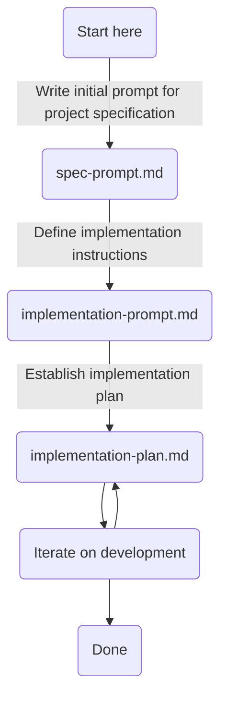

# development-workflows-for-agentic-ai
A suggested workflow for developing using agentic GenAI tools (such as Claude Code)

. 

Full workflow can be seen here - [workflow.svg](assets/images/workflow.svg).

This is the sequence of prompts and files that should be used:
1. [spec-prompt.md](https://github.com/m24murray/development-workflows-for-agentic-ai/blob/main/spec-prompt.md)
2. [spec.md](https://github.com/m24murray/development-workflows-for-agentic-ai/blob/main/spec.md)
3. [implementation-prompt.md](https://github.com/m24murray/development-workflows-for-agentic-ai/blob/main/implementation-prompt.md)
4. [implementation-plan.md](https://github.com/m24murray/development-workflows-for-agentic-ai/blob/main/implementation-plan.md)
5. [copilot-instructions.md](https://github.com/m24murray/development-workflows-for-agentic-ai/blob/main/copilot-instructions-prompt.md)

